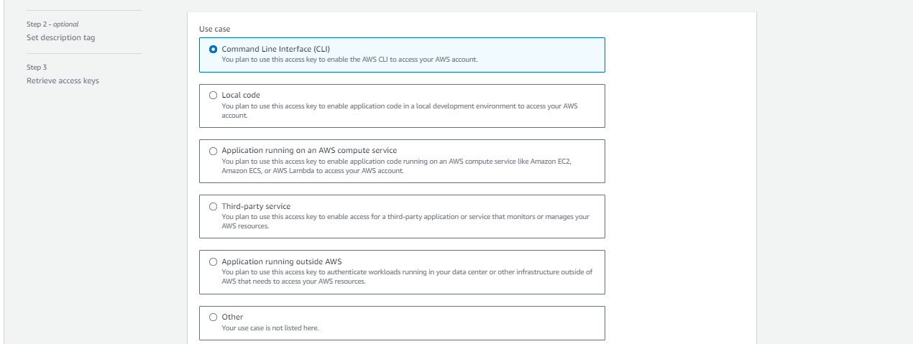
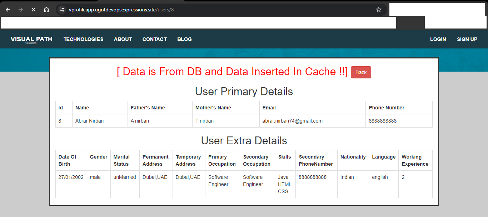
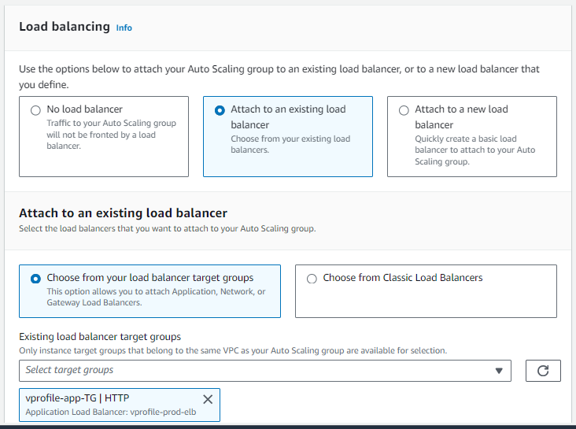

# **VPROJECT - MULTI TIER WEB APPLICATION STACK**

This is an AWS cloud computing project, that has been inspired by Imran Teli.

We are looking at developing a flexible infrastructure.
We would like to modernize our application and make it more effective by using AWS services.

Once we have our stack on AWS Cloud, our architectural design will look something like the diagram below:


Users will access our website by using a URL and that URL will be pointed to an endpoint. This entry will be mentioned in namecahe DNS.

A user browser or the app will use this end point to connect to the load balancer, by using `HTTPS`.
The Certificate for `HTTPS` encryption will be mentioned in ACM Amazon Certificate Manager Service.
So users will access the application load balancer endpoint.

The load balancer will be in a security group and will only allow `HTTPS` traffic.

And then our application load balancer, will route the request to Tomcat instances. Apache tomcat service, will be running on some set of instances which will be managed by an auto scaling group.
So as for high or low load, these instances capacity will be scaled out or scaled in.

These ec2 instances where Tomcat is running, will be in a separate security group and will only allow
traffic on `Port 8080` only from our load balancer.

The vprofile application sits on the Tomcat instance.

The application needs backend servers, which are `MySQL`, `Memcache` and `RabbitMQ`. Information of the backend services or the backend server IP address will be mentioned in Route 53 private DNA zone.

So Tomcat instances will access the backend servers with a name(s) which will be mentioned in Route 53.

Private DNS where the private IP address of our background servers will be mentioned.

These backend ec2 instances, which will be running mysql, RabbitMQ Memcache will be in a separate security group.

## CREATE SECURITY GROUPS

Log into your AWS account, go to ec2 service. The first thing we want to do is create security groups.

We will creat security grups for the Load Balancer, the APP and the Backend Services.

Proceed to Security Group, the create security group

Give it a name

Give a description.

Add rules

- Allow HTTP on port 80 and the source from anywhere because we are hosting a public application.

- Allow HTTPS on port 443 and the source from anywhere.

Save your configuration.


We will create a security group for the Tomcat instance which will host the application.

Inside Security Group, go to create security group again

Give it a name

Give a description.

Add rules

- Tomcat service will run on port 8080 and the source will be from the load balancer. So here we'll select the security group of our load balancer.
- Allow SSH on port 22 and the source from will be from your IP.

Save your configuration.


We will create another security group for the Backend Services that will host MySQL, Memcache and RabbitMQ services.

Inside Security Group, go to create security group again

Give it a name

Give a description.

Add rules

- `MySQL` service will run on `port 3306` and the source will be allowed from only the Application Security Group.
- `Memcache` service will run on `port 11211` and the source will be allowed from only the Application Security Group.
- `RabbitMQ` service will run on `port 5672` and the source will be allowed from only the Application Security Group.
- In this GROUP we have three services and they'll need to communicate with each other so we will create a configuration to accommodate this ability.

  ALL TRAFFIC from itself that is the Security Group ID for backend services.

  _**NOTE**_ : You would have saved the first three configuration to enable you see the security group ID for backend services popup.

- Allow SSH on port 22 and the source from will be from your IP.

Save your configuration.


Remember to create your KEYPAIR

## CREATE EC2 INSTANCES

Clone project from [https://github.com/distinto1/Vprofile_PROJECT.git](https://github.com/distinto1/Vprofile_PROJECT.git)

Create ec2 instances for

1. Mysql database  =>> Almalinux OS 9 

1. Memcache =>> Almalinux OS 9

1. RabbitMQ =>> Almalinux OS 9

1. Apache Tomcat =>> Ubuntu 22.04

### Launch DATABASE
---

Move to the EC2 console

Click `Launch Instance`

For `name` use `vprofile-db01`

Click on `Browse more AMI`

Select `AWS MARKETPLACE AMI`

In the search bar, search for `Almalinux OS 9`

Ensure `x86_64` is selected

Under `instance type`
Select `t2-micro` having `Free tier eligible` on it.

Under `Keypair` select the keypair you created.

Under Security Group select the name of the security group you created for backend services.

Under `Advanced Details` scroll down to `userdata` copy the `mysql.sh script` from userdata folder in cloned REPO and paste here.

Click on `Launch Instance`

### Launch MEMCACHE
---

Still in the EC2 console

Click `Launch Instance`

For `name` use `vprofile_mmc01`

Click on `Browse more AMI`

Select `AWS MARKETPLACE AMI`

In the search bar, search for `Almalinux OS 9`

Ensure `x86_64` is selected

Under `instance type`
Select `t2-micro` having `Free tier eligible` on it.

Under `Keypair` select the keypair you created.

Under Security Group select the name of the security group you created for backend services.

Under `Advanced Details` scroll down to `userdata` copy the `memcache.sh script` from userdata folder in cloned REPO and paste it here.

Click on `Launch Instance`

### Launch RabbitMQ
---

Still in the EC2 console

Click `Launch Instance`

For `name` use `vprofile_rmq01`

Click on `Browse more AMI`

Select `AWS MARKETPLACE AMI`

In the search bar, search for `Almalinux OS 9`

Ensure `x86_64` is selected

Under `instance type`
Select `t2-micro` having `Free tier eligible` on it.

Under `Keypair` select the keypair you created.

Under Security Group select the name of the security group you created for backend services.

Under `Advanced Details` scroll down to `userdata` copy the `rabbitmq.sh script` from userdata folder in cloned REPO and paste it here.

Click on `Launch Instance`

### Launch TOMCAT
---

Still in the EC2 console

Click `Launch Instance`

For `name` use `vprofile_app01`

Select `Ubuntu` in quick start

From the dropdown make sure `Ubuntu Server 22.04`

Under `instance type`
Select `t2-micro` having `Free tier eligible` on it.

Under `Keypair` select the keypair you created.

Under Security Group select the name of the security group you created for backend services.

Under `Advanced Details` scroll down to `userdata` copy the `tomcat_ubuntu.sh script` from userdata folder in cloned REPO and paste it here.

Click on `Launch Instance`

Lets test that our ec2 instances are up and running.


## ROUTE53
---

Search for Route53


## BUILD AND DEPLOY ARTIFACTS
---


Now we have the artifact in the target folder. We need to push the artifact into an S3 bucket.

This will not be  possible without authentication.
So we are going to create an Iam user and also S3 bucket.

Go to `Iam service`

And go to `users` click on `add users`

You can give the name as `S3admin`

Go `next`, select `attach policies directly`

Search for `S3 Full access`

Click `Next`

Click `Create User`


 After you have created the iamuser, click on the `user` and go to `security credentials`

Scroll down  to `create access keys`

Under use case select `Command line interface`



Check `I understand the risk` and click `Next`

Click `create access key`

Make sure to download the csv file to your computer.

Click `Done`

### Configure AWS CLI

In git bash,

```
aws configure
Aws Access Key ID:xxxxxxxxxxxxxxxxx
Aws Secret Access Key:xxxxxxxxxxxxxxxxx
Default Region Name: us-east-1
Default Output format: Json

```

### Create an S3 Bucket from Command line

```
aws s3 mb s3://[bucket-name]
aws s3 cp target/vprofile-v2.war s3://[Bucket-name]/
```


### Download Artifacts into Tomcat Instance

We will need to authenticate Tomcat EC2 intance with S3 using ROLES.

Go to `IAM` select on `roles`

Click `create role`

Select `AWS Service`

Click `usecase:EC2`

Search for Policy on S3

Select `AmazonS3fullaccess`

Give the role a name

Click `Create Policy`


Go to your Tomcat instance on the console.

Refresh it.


Inside your Tomcat Instance:

```
aws s3 ls

aws s3 cp s3://[bucket-name]/vprofile-v2.war  /tmp/

systemctl stop tomcat9

rm -rf /var/lib/tomcat9/webapps/ROOT

cp /tmp/vprofile-v2.war /var/lib/tomcat9/webapps/ROOY.war

systemctl start tomcat9

ls /var/lib/tomcat/webapps/

cat /var/lib/tomcat9/webapps/ROOT/WEB-INF/classes/application.properties

```


### Load Balancer and DNS

Go to `EC2`

In the `loadbalancer` section select `Target Groups`

Click `Target Group`

Under choose a target type, choose `instances`


Target name use `vprofile-app-TG`


Protocol: `8080`

Health Check Path: `/login`

Under advanced Health Checks, select `OVERRIDE: 8080`


Healthy Threshold: `2`

Click `Next`

Select the instance `vprofile-app01`

Confirm the port number to `8080`

Click on `Include as pending below`


Click `Create Target Group`

Go to `Loadbalancer`

Click `Create Loadbalancer`

Select `Application Load Balancer`


Load Balancer name: `vprofile-prod-elb`


In the Network Mappings, select all the Zones


Under Security Group, select `vprofile-ELB-SG`

Listeners and Routing:
Protocol:`HTTP` Port:`80` Forward: `vprofile-app-TG`


Add Listener
Protocol:`HTTPS` Port:`443` Forward: `vprofile-app-TG`


Default SSL/TLS certificate:
From `ACM` Select a Certificate:`ugotdevopsexpression.site`


Click `Create load balancer`

Click `View load Balancer`

_This will take sometime to become available as it is in the provisioning state_

Select the load balancer name: `vprofile-prod-elb`
Copy the DNS NAME under the load balancer
Use the Copied DNS name to create a CNAME record in namecheap.com

Use the DNS name to access the web application while waiting.

http://vprofileapp.ugotdevopsexpresions.site

https://vprofileapp.ugotdevopsexpresions.site





### We need to setup an AUTOSCALING GROUP
---

### We will create an AMI of the Tomcat instance

Select the Tomcat Instance

Go to `Actions` select `image` then `Create Image`


Image name: `vprofile-app-IMAGE`


Click `Create Image`

Go to `AMI` under `Images` to verify the image created


###  We will create a Launch template

Go to `Launch Template`

Click `Launch Template`

Launch Template Name: `vprofile-app-LC`

Description: `vprofile-app-LC`


Application and OS images

  - Select `AMI` Check `owned by me`
  - In `AMI` select the `vprofile-app-image`
  - Instance Type: `t2micro`
  - Keypair: `<select-your-keypair>`
  - Security Group: `<select-your-security-group>`
  - Advanced Details: Instance IAM profile => `<input-your-s3-IAM-role-name>`


* AUTOSCALING GROUP

Go to `Autoscaling`

Click `Auto Scaling Group`

Give a name: `vprofile-app-ASG`

Select your Launch Template: `vprofile-app-LC`


Click `Next`

Select ALL ZONES


Click `Next`

Select `Attach an existing Load Balancer`

Under Existing load balancer Target Groups Select your Target Group `vprofile-app-tg`



Under Health Checks, select `Turn on Elastic LB health checks`


Click `NEXT`

> Desired => 1   Min => 1   Max => 4

Click `NEXT`

Under Scaling Policies, select `Tacket Tracking Scaling Policy`

Click `NEXT`

Review Settings

Click `Create AutoScaling Group`

From Target Group, select `vprofile-app-tg`

Go to attributes session below, Click `Edit`

Under Target Selection Config, enable `Stickiness`


Click `Save Changes`


